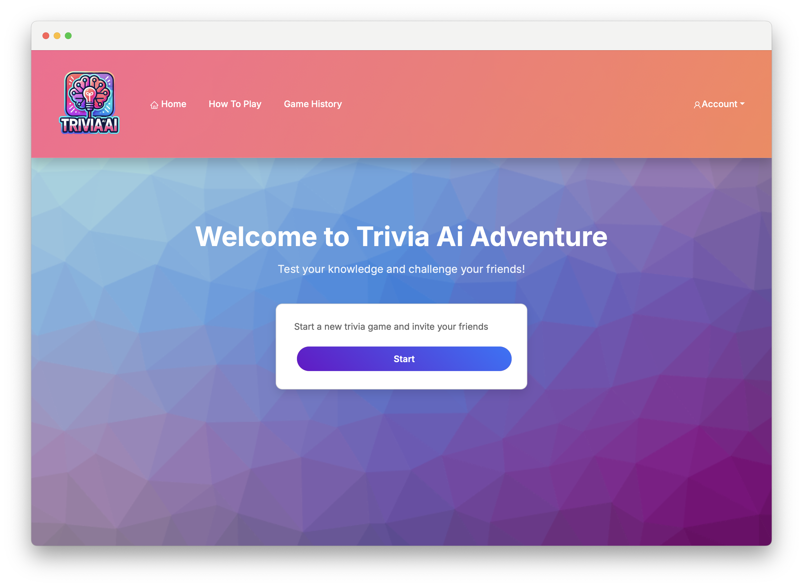
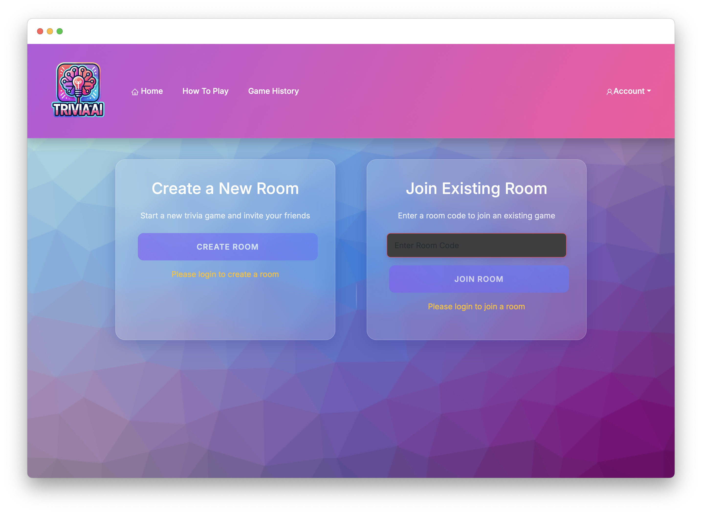
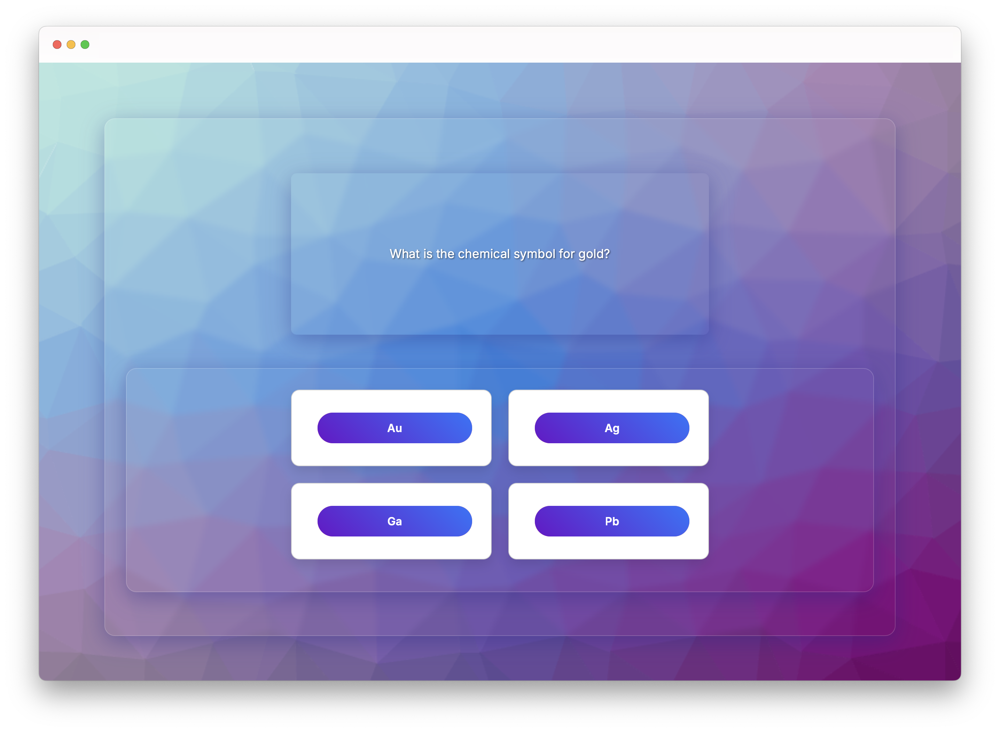
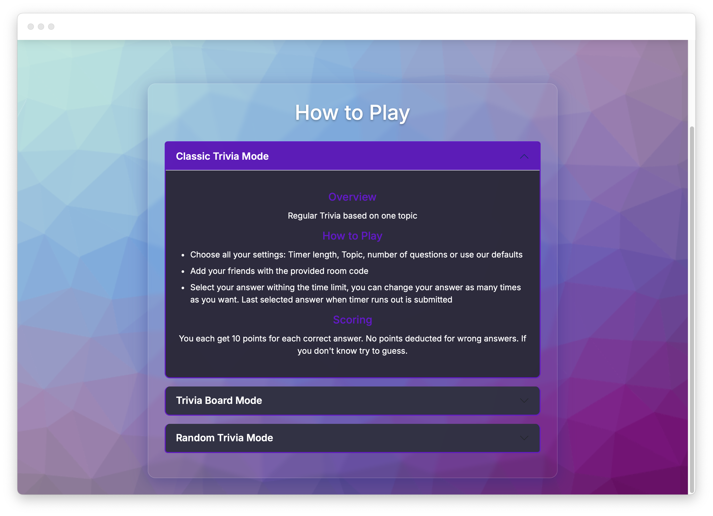

# TriviaAIAdventure
AI-powered multiplayer trivia game using the Open AI GPT-4 engine

## Features
- **Real-Time Multiplayer:** Compete with friends and players worldwide.
- **Dynamic Question Generation:** AI generates a wide variety of questions for endless gameplay.
- **Multiple Game Modes:** 

   - **Classic Trivia:** A set of multiple-choice questions about a topic
   - **Trivia Board:** Our version of Jeopardy with a set of topics each having a set of questions. Everyone gets to answer but the first person to buzz can win more points than the rest.
   - **Randomized Trivia:** Randomly chosen topics. Along with a free response answer format where your answers are graded by the OpenAI's GPT-4o mini model.

- **User Authentication:** Secure user accounts and leaderboard tracking.
- **Social Features:** In-game chat and leaderboards to enhance gameplay.

## Technology Stack
- **Frontend:** React, Bootstrap, HTML5, CSS3
- **Backend:** Node.js, Express.js
- **Database:** MongoDB
- **AI Integration:** OpenAI API with GPT-4o mini model
- **Real-Time Communication:** Socket.io
- **Deployment:** Render

## Quick Look

<div style="display: flex; gap: 0px;">
   
   
</div>

<div style="display: flex; gap: 0px;">
   
   
</div>


## Getting Started

### Prerequisites

- Node.js
- MongoDB
- OpenAI API

### Installation

1. Clone the repository:

   ```
   git clone <repository-url>
   cd <repository-folder>
   ```

2. Navigate to the project directory and install dependencies for both frontend and backend:

   ```
   cd frontend
   npm install
   cd ..

   cd backend
   npm install
   cd ..
   ```

### Running the Project
1. Navigate to the `backend` directory and add `.env` file with `Database_Url` and `OPENAI_API_KEY`:

   ```
   Database_Url = <database-url>
   OPENAI_API_KEY = <openai-api-key>
   ```

2. Navigate to the `frontend` directory and add `.env` file with `VITE_BASE_URL` which the url for your backend and will change depending on how you deploy:

   ```
   VITE_BASE_URL = <vite-url>
   ```

3. Execute `backend`:
   ```
   cd backend
   node app.js
   cd ..
   ```

3. Execute `frontend`:
   ```
   cd frontend
   npm run dev
   cd ..
   ```

### Deployment on Render

1. Deploy the frontend as a Web Service
2. Root Directory = `./frontend`
3. Build Command = `npm install`
4. Start Command = `npm run dev`
5. You will need to navigate to the Environment settings and add the backend Web Service url as `VITE_BASE_URL`
6. Deploy the backend as a Web Service
7. Root Directory = `./backend`
8. Build Command = `npm install`
9. Start Command = `node app.js`
10. You will need to navigate to the Environment settings and add all the needed .env file variables

## License

This project is not licensed for public use. No part of this project may be used, copied, modified, or distributed without explicit permission from the author.

## Disclaimer

This is a private senior project for a group of students at a university, made public only for the class. Feel free to look at the project, but do not copy or fork it.
